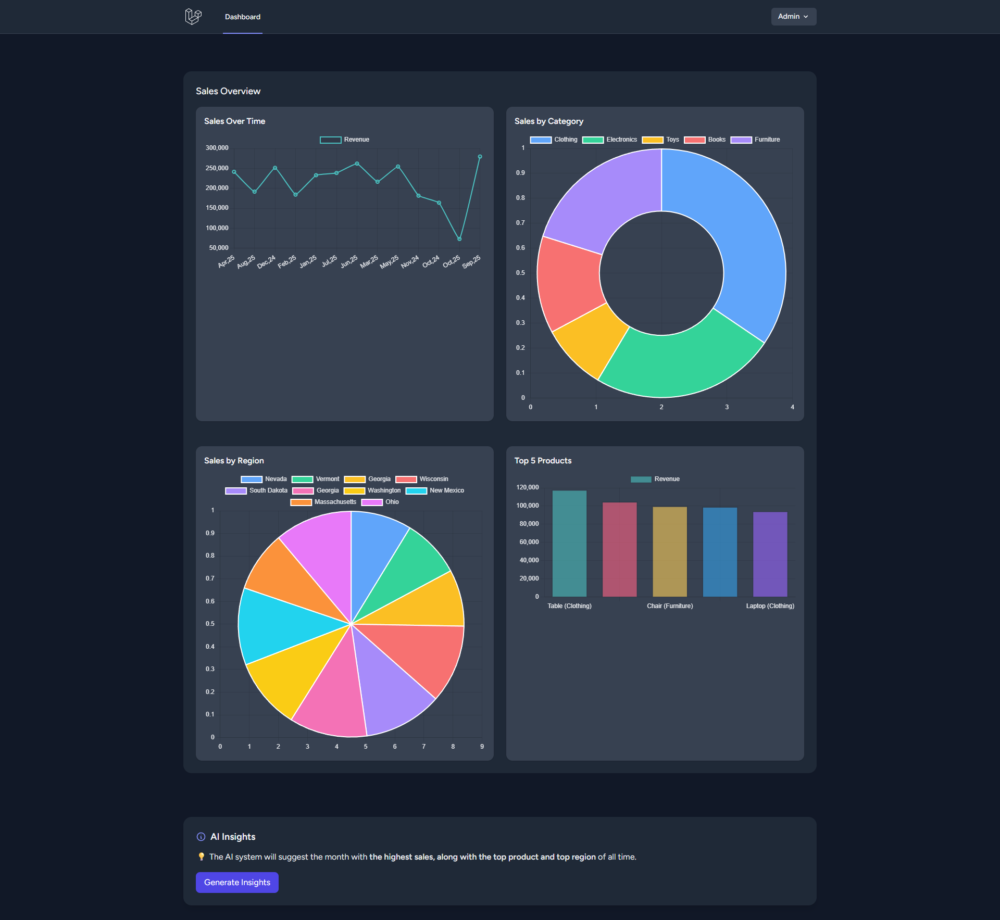
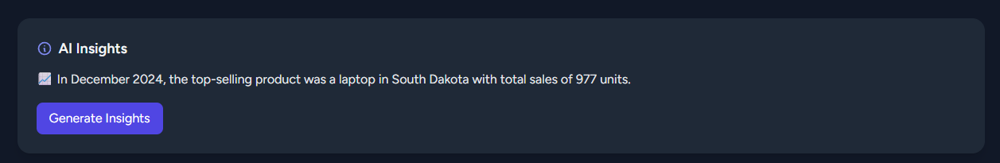
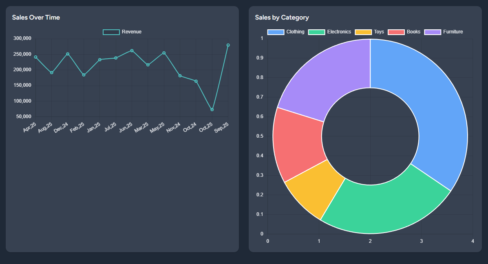
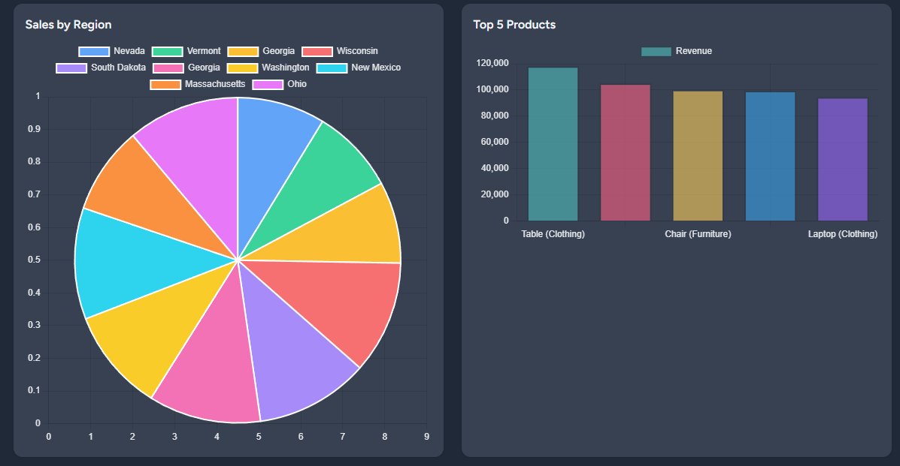

# Sales Insights Platform

Sales Insights is a Laravel-based analytics platform that helps businesses track sales performance, visualize trends, and get AI-powered insights on products, regions, and top-selling months. The AI system is powered by **Ollama**, providing smart insights to make better business decisions.

---

## Features

- **Sales Over Time:** Line chart showing monthly revenue trends.
- **Top Products:** Bar chart highlighting best-selling products.
- **Sales by Region & Category:** Pie/Doughnut charts to identify high-performing areas and categories.
- **AI Insights:** Powered by Ollama, generates actionable insights like top month, product, and region.

---

## Tech Stack

- **Backend:** Laravel 10
- **Frontend:** Tailwind CSS, Blade, Chart.js
- **AI Integration:** Ollama for generating insights
- **Database:** MySQL

---

## Screenshots

### Dashboard Overview


### AI Insights


### Charts Example



---

## Installation

1. Clone the repository:

```bash
git clone https://github.com/tzh19/sales-insights.git
cd sales-insights
```
2. Install dependencies:
```bash
composer install
npm install
npm run dev
```

3. Copy .env.example to .env and configure your database and API keys (Ollama if required).
```bash
cp .env.example .env
php artisan key:generate
```

4. Run migrations and seed the database:
```bash
php artisan migrate --seed
```

5. Start the development server:
```bash
composer run dev
```
Visit http://localhost:8000 to see your dashboard.

## AI Integration (Ollama)
- The platform uses **Ollama** to generate sales insights.
- When you click **Generate Insights**, the system sends your sales data to Ollama’s AI engine, which returns the **top month, product, and region** in a concise summary.
- Ollama ensures insights are relevant and actionable for business decisions.
- ⚠️ **Note:** To try the AI feature locally, you **might need Ollama installed on your machine**.

## Acknowledgements
🤖 Big shoutout to **ChatGPT** for being my coding buddy and guiding me through charts, Blade tweaks, and AI integrations!  

